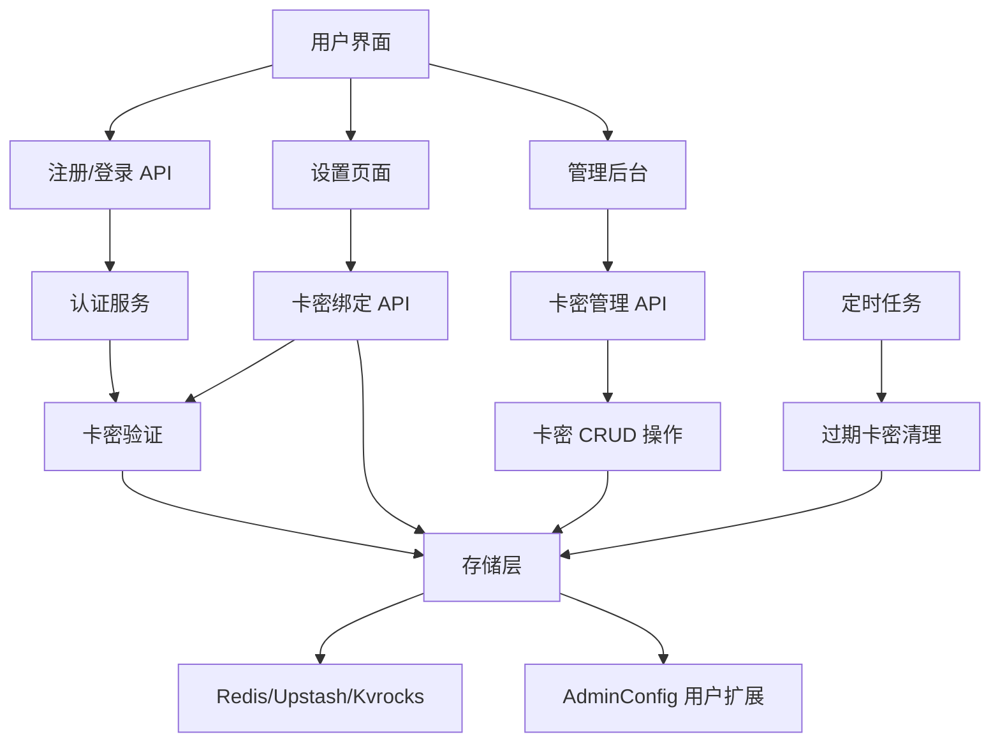
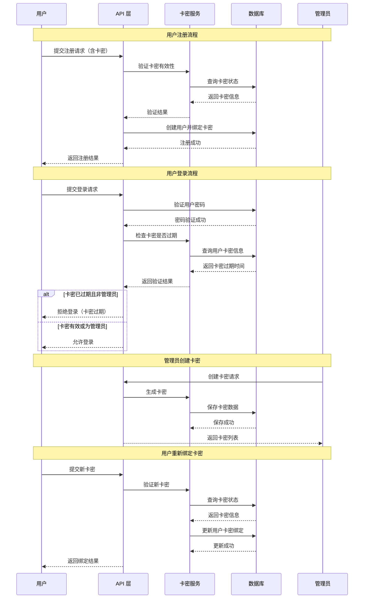

# 卡密系统技术设计文档

Feature Name: card-key-system
Updated: 2026-02-12

## Description

卡密系统是一个用于控制用户访问权限的功能模块。用户在注册或登录时需要绑定有效的卡密，卡密具有时效性（1年、1季、1月、1周）。管理员可以在管理后台创建、查看和管理卡密。系统会在卡密过期前30天提醒用户，过期后禁止用户登录（管理员除外）。

## Architecture

### 系统架构图



### 数据流图



## Components and Interfaces

### 1. 数据类型定义

#### 1.1 卡密类型

```typescript
// 卡密有效期类型
type CardKeyType = 'year' | 'quarter' | 'month' | 'week';

// 卡密状态
type CardKeyStatus = 'unused' | 'used' | 'expired';

// 卡密数据结构
interface CardKey {
  key: string; // 卡密密钥（哈希值）
  keyType: CardKeyType; // 卡密类型
  status: CardKeyStatus; // 卡密状态
  createdAt: number; // 创建时间戳
  expiresAt: number; // 过期时间戳
  boundTo?: string; // 绑定的用户名
  boundAt?: number; // 绑定时间戳
}

// 卡密过期提醒信息
interface CardKeyExpiryWarning {
  daysRemaining: number; // 剩余天数
  expiresAt: number; // 过期时间戳
  isUrgent: boolean; // 是否紧急（7天内）
}
```

#### 1.2 用户信息扩展

```typescript
// 扩展现有的用户信息结构，添加卡密相关字段
interface UserInfoWithCardKey {
  username: string;
  role: 'owner' | 'admin' | 'user';
  tags?: string[];
  enabledApis?: string[];
  banned?: boolean;
  createdAt?: number;
  oidcSub?: string;

  // 新增卡密相关字段
  cardKey?: {
    boundKey: string; // 绑定的卡密（哈希值）
    expiresAt: number; // 卡密过期时间戳
    boundAt: number; // 绑定时间戳
  };
}
```

#### 1.3 卡密生成请求

```typescript
interface CreateCardKeyRequest {
  type: CardKeyType; // 卡密类型
  count?: number; // 生成数量（默认1）
}

interface CreateCardKeyResponse {
  keys: string[]; // 生成的卡密列表（明文，仅返回一次）
  totalCount: number; // 总数
  type: CardKeyType; // 卡密类型
}
```

#### 1.4 卡密绑定请求

```typescript
interface BindCardKeyRequest {
  cardKey: string; // 卡密（明文）
}

interface BindCardKeyResponse {
  success: boolean;
  newExpiryDate: number; // 新的过期时间
  daysExtended: number; // 延长的天数
}
```

### 2. 卡密服务接口

```typescript
interface ICardKeyService {
  // 创建卡密
  createCardKey(type: CardKeyType, count?: number): Promise<string[]>;

  // 验证卡密有效性
  validateCardKey(cardKey: string): Promise<{
    valid: boolean;
    cardKey?: CardKey;
    error?: string;
  }>;

  // 绑定卡密到用户
  bindCardKeyToUser(
    cardKey: string,
    username: string,
  ): Promise<{
    success: boolean;
    error?: string;
  }>;

  // 获取用户卡密信息
  getUserCardKey(username: string): Promise<{
    boundKey: string;
    expiresAt: number;
    boundAt: number;
    daysRemaining: number;
    isExpiring: boolean; // 30天内过期
    isExpired: boolean;
  } | null>;

  // 检查用户卡密是否过期
  isUserCardKeyExpired(username: string): Promise<boolean>;

  // 获取所有卡密列表（管理员）
  getAllCardKeys(): Promise<CardKey[]>;

  // 删除未使用的卡密
  deleteUnusedCardKey(cardKeyHash: string): Promise<boolean>;

  // 清理过期的未使用卡密
  cleanupExpiredCardKeys(): Promise<number>;

  // 导出卡密列表
  exportCardKeys(): Promise<string>;

  // 计算卡密过期时间
  calculateExpiryDate(type: CardKeyType): number;

  // 生成随机卡密
  generateRandomCardKey(): string;

  // 哈希卡密
  hashCardKey(cardKey: string): string;

  // 验证卡密哈希
  verifyCardKeyHash(cardKey: string, hash: string): boolean;
}
```

### 3. API 端点

#### 3.1 卡密管理 API

```
POST   /api/admin/cardkey/create          - 创建卡密
GET    /api/admin/cardkey/list            - 获取卡密列表
DELETE /api/admin/cardkey/:hash            - 删除未使用的卡密
GET    /api/admin/cardkey/export          - 导出卡密列表
POST   /api/admin/cardkey/cleanup         - 清理过期卡密
```

#### 3.2 用户卡密绑定 API

```
POST   /api/user/cardkey/bind             - 绑定新卡密
GET    /api/user/cardkey/status           - 获取当前卡密状态
```

#### 3.3 注册和登录 API 修改

```
POST   /api/register                      - 注册时验证卡密
POST   /api/login                          - 登录时检查卡密过期
```

### 4. 存储层接口扩展

```typescript
interface IStorageWithCardKey extends IStorage {
  // 卡密相关方法
  createCardKey(cardKey: CardKey): Promise<void>;
  getCardKey(keyHash: string): Promise<CardKey | null>;
  getAllCardKeys(): Promise<CardKey[]>;
  updateCardKey(keyHash: string, updates: Partial<CardKey>): Promise<void>;
  deleteCardKey(keyHash: string): Promise<void>;

  // 用户卡密信息（存储在 AdminConfig 中）
  getUserCardKeyInfo(username: string): Promise<{
    boundKey: string;
    expiresAt: number;
    boundAt: number;
  } | null>;
  updateUserCardKeyInfo(
    username: string,
    info: { boundKey: string; expiresAt: number; boundAt: number },
  ): Promise<void>;
}
```

## Data Models

### 1. 数据库键命名规范

```
# 卡密数据
cardkey:hash:{hash}          -> CardKey JSON

# 卡密索引
cardkey:status:unused        -> Set<hash>
cardkey:status:used          -> Set<hash>
cardkey:status:expired       -> Set<hash>
cardkey:user:{username}      -> hash (用户绑定的卡密)
```

### 2. Redis 数据结构示例

```json
{
  "cardkey:hash:abc123...": {
    "key": "abc123...",
    "keyType": "month",
    "status": "unused",
    "createdAt": 1706745600000,
    "expiresAt": 1709337600000,
    "boundTo": null,
    "boundAt": null
  }
}
```

### 3. 用户信息扩展示例

```json
{
  "username": "testuser",
  "role": "user",
  "banned": false,
  "createdAt": 1706745600000,
  "cardKey": {
    "boundKey": "abc123...",
    "expiresAt": 1709337600000,
    "boundAt": 1706832000000
  }
}
```

## Correctness Properties

### 1. 不变性约束

1. **卡密唯一性**: 每个卡密密钥的哈希值必须唯一
2. **卡密单次绑定**: 未使用的卡密只能被一个用户绑定一次
3. **卡密状态不可逆**: 已使用的卡密不能变为未使用，已过期的卡密不能变为未过期
4. **管理员豁免**: owner 和 admin 角色不受卡密限制
5. **过期时间单调递增**: 用户重新绑定卡密时，过期时间必须大于原过期时间

### 2. 业务规则约束

1. **卡密格式**: 卡密必须为 16-32 位的字母数字组合
2. **卡密有效期**:
   - year: 365 天
   - quarter: 90 天
   - month: 30 天
   - week: 7 天
3. **过期提醒**:
   - 剩余时间 ≤ 30 天: 显示一般提醒
   - 剩余时间 ≤ 7 天: 显示紧急提醒
4. **删除限制**: 已绑定的卡密不可删除
5. **注册要求**: 新用户注册时必须绑定有效卡密（除非 AllowRegister 为 false）

## Error Handling

### 1. 错误码定义

| 错误码               | 错误信息             | HTTP 状态码 | 说明                     |
| -------------------- | -------------------- | ----------- | ------------------------ |
| CARDKEY_INVALID      | 卡密无效或不存在     | 400         | 提供的卡密不存在         |
| CARDKEY_ALREADY_USED | 卡密已被使用         | 400         | 卡密已被其他用户绑定     |
| CARDKEY_EXPIRED      | 卡密已过期           | 400         | 卡密已过期               |
| CARDKEY_NOT_BOUND    | 用户未绑定卡密       | 400         | 用户账户没有绑定卡密     |
| CARDKEY_DELETE_USED  | 无法删除已绑定的卡密 | 400         | 尝试删除已使用的卡密     |
| CARDKEY_REQUIRED     | 需要绑定卡密         | 400         | 用户需要绑定卡密才能访问 |
| UNAUTHORIZED         | 未授权               | 401         | 用户未登录或权限不足     |
| DATABASE_ERROR       | 数据库错误           | 500         | 数据库操作失败           |

### 2. 错误处理策略

1. **用户注册时**:
   - 卡密无效: 返回 400，提示用户检查卡密
   - 卡密已使用: 返回 400，提示卡密已被使用
   - 数据库错误: 返回 500，记录日志并提示用户稍后重试

2. **用户登录时**:
   - 卡密过期: 返回 401，提示用户卡密已过期，请在设置页面重新绑定
   - 数据库错误: 返回 500，记录日志并提示用户稍后重试

3. **用户重新绑定时**:
   - 卡密无效: 返回 400，提示用户检查卡密
   - 卡密已使用: 返回 400，提示卡密已被使用
   - 新卡密过期时间早于当前卡密: 返回 400，提示无效操作
   - 数据库错误: 返回 500，记录日志并提示用户稍后重试

4. **管理员操作时**:
   - 权限不足: 返回 401，提示需要管理员权限
   - 卡密不存在: 返回 404，提示卡密不存在
   - 无法删除已绑定的卡密: 返回 400，提示卡密已被使用

## Test Strategy

### 1. 单元测试

**测试文件**: `src/lib/cardkey.test.ts`

1. **卡密生成测试**:
   - 测试生成指定类型的卡密
   - 测试批量生成卡密
   - 测试卡密哈希正确性
   - 测试卡密过期时间计算

2. **卡密验证测试**:
   - 测试有效卡密验证
   - 测试无效卡密验证
   - 测试已使用卡密验证
   - 测试已过期卡密验证

3. **卡密绑定测试**:
   - 测试成功绑定卡密到用户
   - 测试重复绑定同一卡密
   - 测试绑定已使用的卡密
   - 测试绑定无效卡密

4. **卡密过期检查测试**:
   - 测试有效卡密不报过期
   - 测试过期卡密报过期
   - 测试管理员豁免

### 2. 集成测试

**测试文件**: `src/app/api/admin/cardkey/route.test.ts`

1. **卡密管理 API 测试**:
   - 测试创建卡密 API
   - 测试获取卡密列表 API
   - 测试删除未使用的卡密 API
   - 测试导出卡密列表 API
   - 测试清理过期卡密 API

2. **用户卡密绑定 API 测试**:
   - 测试绑定新卡密 API
   - 测试获取卡密状态 API

### 3. 端到端测试

**测试文件**: `e2e/cardkey.spec.ts`

1. **用户注册流程测试**:
   - 测试使用有效卡密注册
   - 测试使用无效卡密注册
   - 测试使用已使用卡密注册

2. **用户登录流程测试**:
   - 测试有效卡密用户登录
   - 测试过期卡密用户登录被拒
   - 测试管理员登录（无卡密限制）

3. **卡密过期提醒测试**:
   - 测试30天内过期提醒显示
   - 测试7天内紧急提醒显示
   - 测试过期后无提醒

4. **用户重新绑定卡密测试**:
   - 测试成功绑定新卡密
   - 测试绑定后过期时间更新
   - 测试提醒消失

### 4. 性能测试

1. **卡密查询性能**: 测试大量卡密（1000+）下的查询性能
2. **并发绑定测试**: 测试多个用户同时绑定卡密的情况
3. **过期清理性能**: 测试清理大量过期卡密的性能

## Implementation Steps

### 阶段 1: 数据层实现

1. 扩展 `IStorage` 接口，添加卡密相关方法
2. 在 `UpstashRedisStorage`、`RedisStorage`、`KvrocksStorage` 中实现卡密方法
3. 扩展用户信息结构，添加 `cardKey` 字段

### 阶段 2: 业务逻辑层实现

1. 创建 `src/lib/cardkey.ts`，实现 `CardKeyService`
2. 实现卡密生成、验证、绑定逻辑
3. 实现卡密过期检查逻辑
4. 在 `DbManager` 中添加卡密相关方法

### 阶段 3: API 层实现

1. 创建 `src/app/api/admin/cardkey/route.ts`
2. 创建 `src/app/api/user/cardkey/route.ts`
3. 修改 `src/app/api/login/route.ts`，添加卡密过期检查
4. 修改 `src/app/api/register/route.ts`（如果存在），添加卡密验证

### 阶段 4: 前端界面实现

1. 创建管理员卡密管理页面
2. 修改用户设置页面，添加卡密绑定界面
3. 添加卡密过期提醒组件
4. 修改登录页面，显示卡密过期错误

### 阶段 5: 定时任务实现

1. 创建定时任务，自动清理过期卡密
2. 集成到现有的 cron 系统

### 阶段 6: 测试和文档

1. 编写单元测试
2. 编写集成测试
3. 更新用户文档

## References

[^1]: (File#L1-556) - 数据库管理器接口定义 [src/lib/db.ts](src/lib/db.ts)

[^2]: (File#L1-201) - 管理员配置类型定义 [src/lib/admin.types.ts](src/lib/admin.types.ts)

[^3]: (File#L1-80) - 认证工具函数 [src/lib/auth.ts](src/lib/auth.ts)

[^4]: (File#L1-63) - 管理员认证工具函数 [src/lib/admin-auth.ts](src/lib/admin-auth.ts)

[^5]: (File#L1-212) - 登录 API 实现 [src/app/api/login/route.ts](src/app/api/login/route.ts)

[^6]: (File#L1-501) - 用户管理 API 实现 [src/app/api/admin/user/route.ts](src/app/api/admin/user/route.ts)
