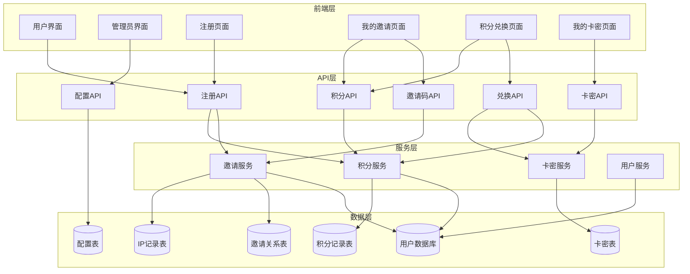
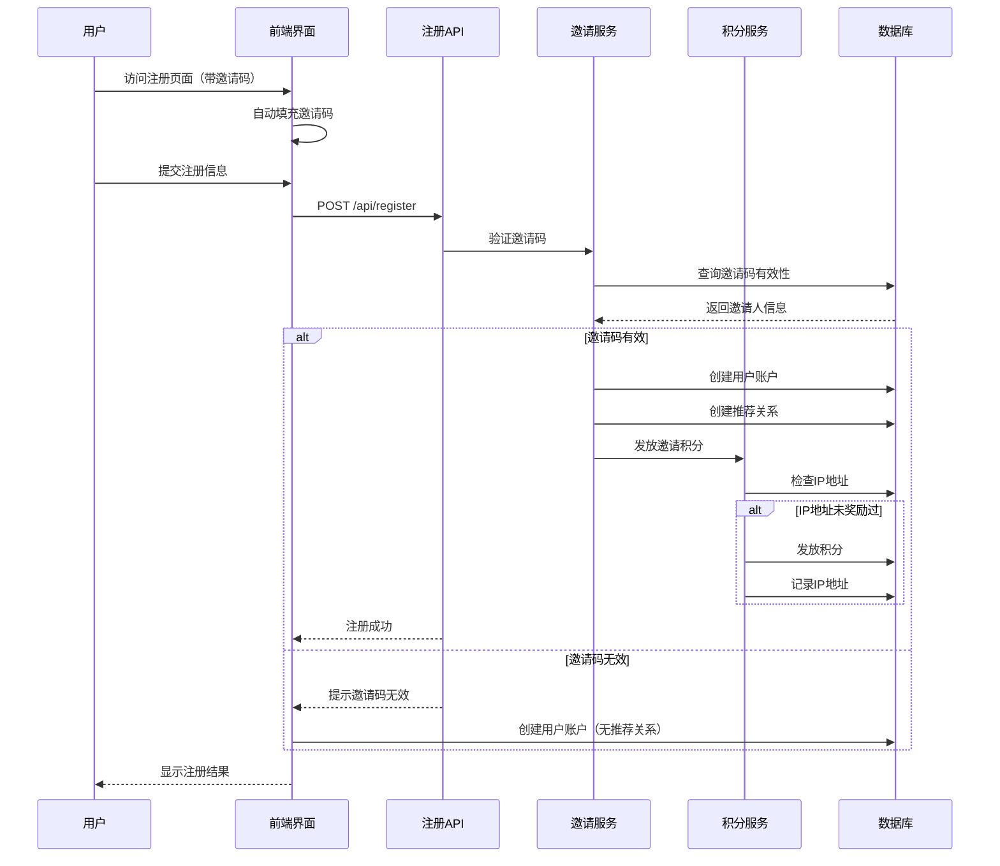
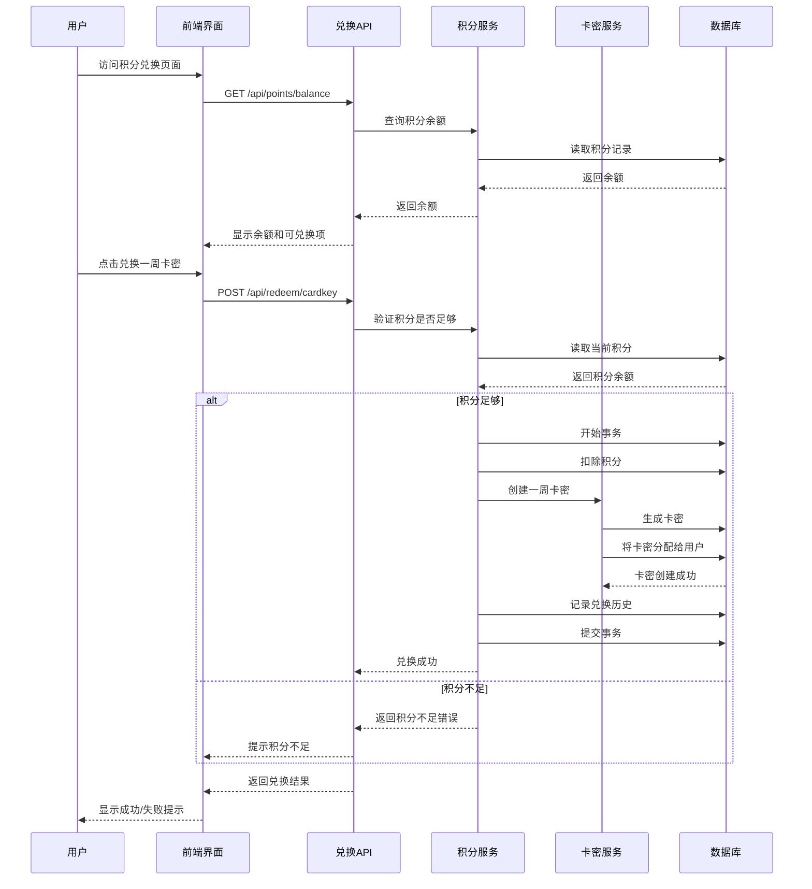

# Invitation Rewards System

Feature Name: invitation-rewards
Updated: 2026-02-15

## Description

邀请奖励系统是一个用于激励用户邀请好友注册并获取积分的功能。用户通过专属邀请码分享给好友,好友注册成功后邀请人和被邀请人均可获得积分奖励。用户可以使用积分兑换一周卡密,卡密可以自用或分享给好友使用。系统包含IP地址防作弊机制,防止同一设备重复获取积分奖励。管理员可以在后台配置积分奖励数量和兑换所需积分。用户可以在"我的卡密"页面查看和管理自己拥有的所有卡密。

## Architecture

### 系统架构图



### 邀请注册流程



### 积分兑换流程



## Components and Interfaces

### 邀请服务 (InvitationService)

**职责**: 管理邀请码的生成、验证和推荐关系

**接口**:

- `generateInvitationCode(username: string): string` - 为用户生成邀请码
- `validateInvitationCode(code: string): Promise<{ valid: boolean; inviter?: string }>` - 验证邀请码有效性
- `createReferral(inviter: string, invitee: string, code: string, ip: string): Promise<void>` - 创建推荐关系
- `getUserInvitationInfo(username: string): Promise<{ code: string; totalInvites: number; totalRewards: number }>` - 获取用户邀请信息
- `checkIPRewarded(ip: string): Promise<boolean>` - 检查IP是否已奖励过

### 积分服务 (PointsService)

**职责**: 管理用户的积分余额、积分变更和兑换

**接口**:

- `getUserBalance(username: string): Promise<number>` - 获取用户积分余额
- `addPoints(username: string, amount: number, reason: string, relatedUser?: string): Promise<void>` - 增加用户积分
- `deductPoints(username: string, amount: number, reason: string): Promise<void>` - 扣除用户积分
- `getPointsHistory(username: string, page?: number, pageSize?: number): Promise<PointsHistory[]>` - 获取积分历史记录
- `redeemForCardKey(username: string): Promise<{ success: boolean; cardKey?: string; error?: string }>` - 使用积分兑换一周卡密

### 卡密服务 (CardKeyService - 扩展现有服务)

**职责**: 管理卡密的创建、验证和用户卡密列表

**新接口**:

- `createCardKeyForUser(username: string, type: CardKeyType): Promise<string>` - 为指定用户创建卡密
- `getUserCardKeys(username: string): Promise<UserCardKeyInfo[]>` - 获取用户拥有的所有卡密

### 配置服务 (ConfigService)

**职责**: 管理系统配置包括积分奖励和兑换规则

**接口**:

- `getInvitationConfig(): Promise<InvitationConfig>` - 获取邀请配置
- `updateInvitationConfig(config: InvitationConfig): Promise<void>` - 更新邀请配置

### API 路由

**新增API路由**:

- `POST /api/register` - 扩展注册接口支持邀请码
- `GET /api/invitation/info` - 获取用户邀请信息
- `GET /api/invitation/code` - 获取用户邀请码
- `GET /api/points/balance` - 获取用户积分余额
- `GET /api/points/history` - 获取用户积分历史
- `POST /api/redeem/cardkey` - 使用积分兑换卡密
- `GET /api/cardkeys/my` - 获取用户的所有卡密
- `GET /api/admin/invitation-config` - 获取邀请配置（管理员）
- `PUT /api/admin/invitation-config` - 更新邀请配置（管理员）

## Data Models

### Invitation（邀请关系表）

```typescript
interface Invitation {
  id: string;
  inviter: string; // 邀请人用户名
  invitee: string; // 被邀请人用户名
  invitationCode: string; // 邀请码
  ipAddress: string; // 注册IP地址
  rewarded: boolean; // 是否已发放积分奖励
  rewardTime?: number; // 奖励发放时间
  createdAt: number; // 创建时间
}
```

### PointsRecord（积分记录表）

```typescript
interface PointsRecord {
  id: string;
  username: string; // 用户名
  type: 'earn' | 'redeem'; // 类型：获取或消费
  amount: number; // 积分数量（正数为获取，负数为消费）
  reason: string; // 原因描述
  relatedUser?: string; // 相关用户（如邀请人）
  cardKeyId?: string; // 关联的卡密ID（兑换时）
  createdAt: number; // 创建时间
}
```

### UserPoints（用户积分表）

```typescript
interface UserPoints {
  username: string; // 用户名（主键）
  balance: number; // 积分余额
  totalEarned: number; // 累计获取积分
  totalRedeemed: number; // 累计消费积分
  updatedAt: number; // 更新时间
}
```

### IPRewardRecord（IP奖励记录表）

```typescript
interface IPRewardRecord {
  id: string;
  ipAddress: string; // IP地址（主键）
  inviter: string; // 邀请人用户名
  invitee: string; // 被邀请人用户名
  rewardTime: number; // 奖励时间
}
```

### InvitationConfig（邀请配置表）

```typescript
interface InvitationConfig {
  rewardPoints: number; // 邀请一人获得的积分
  redeemThreshold: number; // 兑换一周卡密所需积分
  cardKeyType: CardKeyType; // 兑换的卡密类型（week）
  updatedAt: number; // 配置更新时间
}
```

### UserCardKey（用户卡密表 - 扩展现有结构）

```typescript
interface UserCardKey {
  id: string;
  keyHash: string; // 卡密哈希
  username: string; // 拥有该卡密的用户名
  type: CardKeyType; // 卡密类型
  status: 'unused' | 'used' | 'expired'; // 卡密状态
  source: 'invitation' | 'redeem' | 'manual'; // 卡密来源
  createdAt: number; // 创建时间
  expiresAt: number; // 过期时间
  usedAt?: number; // 使用时间
  usedBy?: string; // 使用该卡密的用户
  notes?: string; // 备注（如来源说明）
}
```

## Correctness Properties

### 不变式 (Invariants)

1. **积分余额非负**: 用户的积分余额永远不能为负数
   - ∀ u ∈ Users: UserPoints.balance >= 0

2. **推荐关系唯一性**: 一个用户只能作为被邀请人存在一次
   - ∀ i ∈ Invitations: i.invitee 在 Invitations 表中唯一

3. **邀请码唯一性**: 邀请码在整个系统中必须唯一
   - ∀ u ∈ Users: 用户邀请码唯一

4. **IP奖励唯一性**: 同一个IP地址只能奖励一次
   - ∀ ip1, ip2 ∈ IPRewardRecord: ip1.ipAddress = ip2.ipAddress ⇒ ip1 = ip2

5. **积分守恒**: 积分获取总数 = 积分消费总数 + 当前余额
   - ∀ u ∈ Users: UserPoints.totalEarned = UserPoints.totalRedeemed + UserPoints.balance

6. **卡密使用唯一性**: 一个卡密只能被一个用户绑定一次
   - ∀ ck ∈ UserCardKeys: ck.status = 'used' ⇒ ck.usedBy 唯一

### 约束 (Constraints)

1. **积分发放**: 邀请奖励积分必须为正整数
   - InvitationConfig.rewardPoints > 0

2. **兑换门槛**: 兑换所需积分必须为正整数且大于0
   - InvitationConfig.redeemThreshold > 0

3. **积分充足**: 兑换卡密前必须验证用户积分充足
   - 用户发起兑换 ⇒ UserPoints.balance >= InvitationConfig.redeemThreshold

4. **事务原子性**: 积分变更和卡密生成必须在同一事务中完成
   - 兑换操作要么全部成功，要么全部回滚

5. **并发控制**: 并发兑换请求必须使用乐观锁或悲观锁防止积分超支
   - 并发兑换 ⇒ 使用版本号或行锁

## Error Handling

### 错误场景和处理策略

| 错误场景       | 错误码                    | 错误消息                 | 处理策略                           |
| -------------- | ------------------------- | ------------------------ | ---------------------------------- |
| 邀请码无效     | INVALID_INVITE_CODE       | 邀请码无效或不存在       | 允许用户继续正常注册（无推荐关系） |
| 邀请码已使用   | INVITE_CODE_USED          | 邀请码已被使用           | 提示用户该邀请码无效               |
| 积分不足       | INSUFFICIENT_POINTS       | 积分不足，无法兑换       | 显示当前积分和所需积分数量         |
| IP已奖励       | IP_ALREADY_REWARDED       | 该IP地址已领取过奖励     | 注册成功但不发放积分奖励           |
| 并发兑换冲突   | CONCURRENT_REDEEM         | 系统繁忙，请稍后重试     | 提示用户稍后重试，使用重试机制     |
| 卡密生成失败   | CARDKEY_GENERATION_FAILED | 卡密生成失败，积分已退回 | 回滚积分扣除，显示错误日志         |
| 数据库事务失败 | TRANSACTION_FAILED        | 操作失败，请稍后重试     | 回滚所有操作，记录错误日志         |
| 配置验证失败   | INVALID_CONFIG            | 配置值无效               | 保持原配置不变，提示具体错误       |

### 重试策略

- **数据库操作失败**: 使用指数退避重试，最多重试3次
- **并发兑换冲突**: 指数退避重试，最多重试5次
- **网络请求**: 超时设置10秒，失败后重试3次

### 日志记录

- **积分变更**: 记录用户名、变更数量、变更原因、时间、IP地址
- **兑换操作**: 记录用户名、兑换时间、消耗积分、生成的卡密
- **错误情况**: 记录错误码、错误消息、堆栈信息、相关用户信息

## Test Strategy

### 单元测试

1. **InvitationService**
   - 测试邀请码生成（唯一性、长度）
   - 测试邀请码验证（有效、无效、已使用）
   - 测试推荐关系创建
   - 测试IP奖励检查

2. **PointsService**
   - 测试积分增加和扣除
   - 测试积分余额查询
   - 测试积分历史记录
   - 测试积分兑换逻辑
   - 测试并发兑换（积分充足、不足）

3. **CardKeyService**
   - 测试为用户创建卡密
   - 测试获取用户卡密列表
   - 测试卡密状态更新

### 集成测试

1. **邀请注册流程**
   - 测试通过邀请码注册并发放积分
   - 测试邀请码无效时的注册
   - 测试IP地址防作弊机制
   - 测试同一IP多次注册只奖励一次

2. **积分兑换流程**
   - 测试积分充足时的兑换
   - 测试积分不足时的兑换
   - 测试兑换成功后的卡密生成
   - 测试兑换失败时的回滚

3. **管理后台功能**
   - 测试配置更新
   - 测试配置验证
   - 测试配置历史记录

### 端到端测试

1. **完整用户流程**
   - 用户注册 -> 获取邀请码 -> 邀请好友 -> 好友注册 -> 获得积分 -> 兑换卡密 -> 查看卡密

2. **管理员流程**
   - 管理员登录 -> 修改配置 -> 验证配置生效 -> 查看邀请统计

3. **异常场景**
   - 网络中断、数据库故障、并发冲突等场景的恢复

### 性能测试

1. **并发邀请注册**: 测试100个用户同时注册的性能
2. **并发兑换**: 测试50个用户同时兑换卡密的性能
3. **数据查询**: 测试大量积分历史记录的查询性能

### 安全测试

1. **邀请码安全性**: 测试邀请码是否可预测
2. **IP伪造**: 测试IP地址伪造的场景
3. **并发攻击**: 测试恶意用户通过并发请求获取大量积分
4. **SQL注入**: 测试API接口的SQL注入防护

## References

[^1]: (Workspace) - 现有卡密系统需求文档 `2026-02-12-card-key-system/requirements.md`

[^2]: (Workspace) - 现有卡密服务实现 `src/lib/cardkey.ts`

[^3]: (Workspace) - 数据库接口定义 `src/lib/types.ts`

[^4]: (Workspace) - 数据库实现 `src/lib/db.ts`

[^5]: (Next.js) - Next.js API Routes 文档 https://nextjs.org/docs/api-routes/introduction

[^6]: (Redis) - Redis 数据结构 https://redis.io/docs/data-types/
