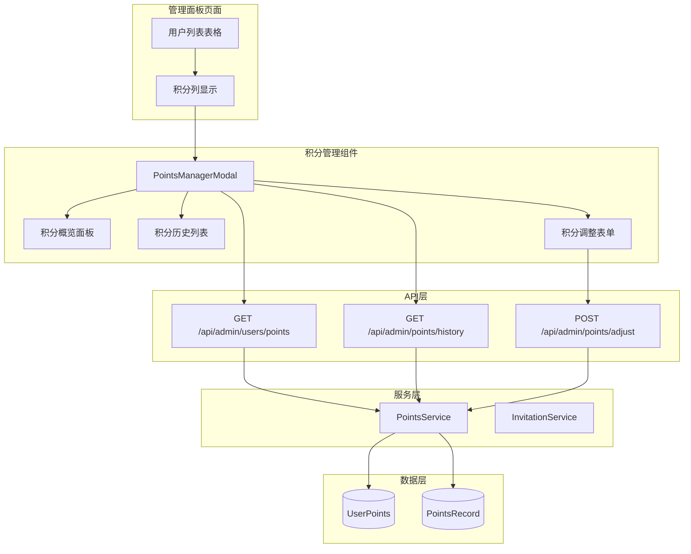
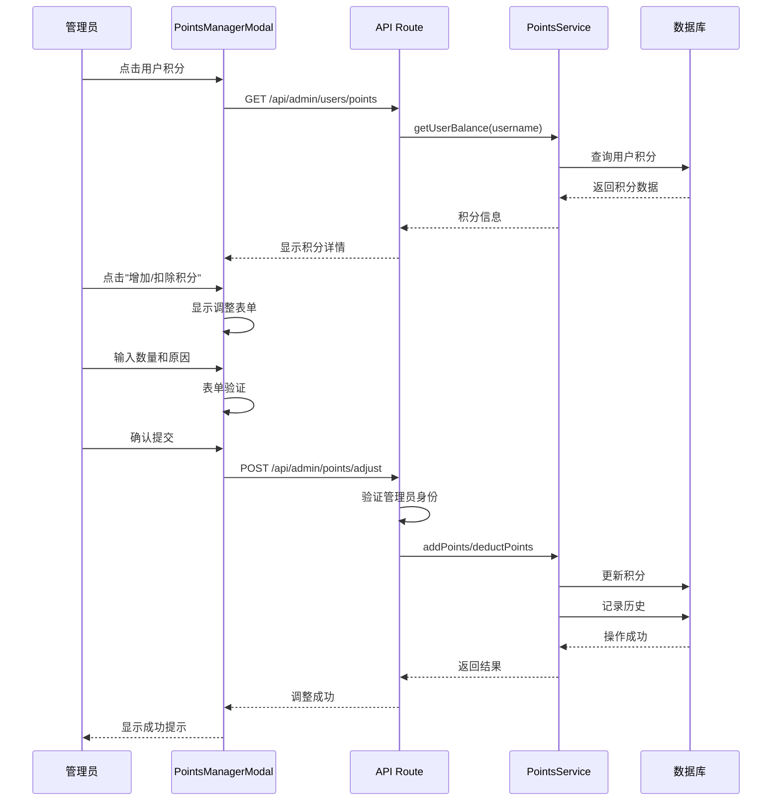

# Admin Points Management

Feature Name: admin-points-management
Updated: 2026-02-16

## Description

管理员积分管理功能集成到现有的管理面板用户列表中，允许管理员查看每个用户的积分信息，并通过弹窗方式对单个用户的积分进行增加或扣除操作。该功能复用现有的积分服务（PointsService），确保积分操作的一致性和可靠性。

## Architecture

### 组件架构图



### 积分调整流程



## Components and Interfaces

### PointsManagerModal 组件

**职责**: 积分管理弹窗组件，显示用户积分详情并提供积分调整功能

**Props**:

```typescript
interface PointsManagerModalProps {
  isOpen: boolean;
  onClose: () => void;
  username: string;
  onSuccess: () => void;
}
```

**状态管理**:

```typescript
interface PointsManagerState {
  pointsInfo: {
    balance: number;
    totalEarned: number;
    totalRedeemed: number;
  } | null;
  history: PointsRecord[];
  loading: boolean;
  adjusting: boolean;
  showAdjustForm: boolean;
  adjustType: 'add' | 'deduct';
  adjustAmount: number;
  adjustReason: string;
  page: number;
  hasMore: boolean;
}
```

### API 路由

**新增API路由**:

1. `GET /api/admin/users/points` - 获取所有用户的积分信息列表
   - 权限: owner 或 admin
   - 返回: 用户名、积分余额、累计获取、累计消费

2. `GET /api/admin/points/history?username=xxx&page=1&pageSize=20` - 获取用户积分历史
   - 权限: owner 或 admin
   - 返回: 积分历史记录列表

3. `POST /api/admin/points/adjust` - 调整用户积分
   - 权限: owner 或 admin
   - 请求体: `{ username: string; type: 'add' | 'deduct'; amount: number; reason: string }`
   - 返回: 操作结果

### PointsService 扩展

**新增方法**:

```typescript
class PointsService {
  static async adjustPoints(
    username: string,
    type: 'add' | 'deduct',
    amount: number,
    reason: string,
    adminUsername: string,
  ): Promise<{ success: boolean; error?: string }> {
    if (type === 'add') {
      await this.addPoints(
        username,
        amount,
        `管理调整: ${reason}`,
        adminUsername,
      );
    } else {
      await this.deductPoints(username, amount, `管理调整: ${reason}`);
    }
    return { success: true };
  }

  static async getAllUsersPoints(): Promise<UserPointsInfo[]> {
    const allUsers = await db.getAllUsers();
    const usersPoints: UserPointsInfo[] = [];

    for (const username of allUsers) {
      const points = await db.getUserPoints(username);
      usersPoints.push({
        username,
        balance: points?.balance || 0,
        totalEarned: points?.totalEarned || 0,
        totalRedeemed: points?.totalRedeemed || 0,
      });
    }

    return usersPoints;
  }
}
```

## Data Models

### PointsRecord 扩展

```typescript
interface PointsRecord {
  id: string;
  username: string;
  type: 'earn' | 'redeem' | 'admin_adjust'; // 新增 admin_adjust 类型
  amount: number;
  reason: string;
  relatedUser?: string;
  cardKeyId?: string;
  adminUsername?: string; // 新增：执行调整的管理员用户名
  createdAt: number;
}
```

### UserPointsInfo（新增）

```typescript
interface UserPointsInfo {
  username: string;
  balance: number;
  totalEarned: number;
  totalRedeemed: number;
}
```

## UI Design

### 用户列表积分列

在现有用户列表表格中新增"积分"列：

| 用户名 | 角色 | 状态 | 用户组 | 采集源权限 | **积分** | TVBox Token | 操作 |
| ------ | ---- | ---- | ------ | ---------- | -------- | ----------- | ---- |
| user1  | 普通 | 正常 | VIP    | 5个源      | **100**  | 有          | ...  |

- 积分数值可点击，点击后打开积分详情弹窗
- 积分数值支持排序（升序/降序）

### 积分详情弹窗布局

```
┌─────────────────────────────────────────────────────────────┐
│  用户积分管理 - {username}                            [X]    │
├─────────────────────────────────────────────────────────────┤
│                                                             │
│  ┌─────────────┐ ┌─────────────┐ ┌─────────────┐           │
│  │   当前余额   │ │  累计获取   │ │  累计消费   │           │
│  │    100      │ │    500      │ │    400      │           │
│  └─────────────┘ └─────────────┘ └─────────────┘           │
│                                                             │
│  ┌─────────────────────────────────────────────────────┐   │
│  │  积分历史                                             │   │
│  │  ─────────────────────────────────────────────────   │   │
│  │  2026-02-16 10:30  管理调整  +50  管理员手动奖励      │   │
│  │  2026-02-15 15:20  获取      +100 邀请用户注册       │   │
│  │  2026-02-14 09:10  消费      -300 兑换一周卡密       │   │
│  │  ...                                                 │   │
│  │                                          [加载更多]  │   │
│  └─────────────────────────────────────────────────────┘   │
│                                                             │
│  ┌─────────────────────────────────────────────────────┐   │
│  │  积分操作                                             │   │
│  │  ─────────────────────────────────────────────────   │   │
│  │  [增加积分]              [扣除积分]                   │   │
│  └─────────────────────────────────────────────────────┘   │
│                                                             │
└─────────────────────────────────────────────────────────────┘
```

### 积分调整表单

点击"增加积分"或"扣除积分"后展开表单：

```
┌─────────────────────────────────────────────────────────────┐
│  增加积分                                                    │
├─────────────────────────────────────────────────────────────┤
│                                                             │
│  积分数量: [          ] (必须为正整数)                       │
│                                                             │
│  调整原因: [                                          ]     │
│           (必填，不超过200字符)                              │
│                                                             │
│              [取消]  [确认增加]                              │
│                                                             │
└─────────────────────────────────────────────────────────────┘
```

## Correctness Properties

### 不变式 (Invariants)

1. **积分余额非负**: 用户的积分余额永远不能为负数
   - ∀ u ∈ Users: UserPoints.balance >= 0

2. **扣除不超过余额**: 管理员扣除积分时，扣除数量不能超过当前余额
   - deduct(u, amount) ⇒ amount <= UserPoints.balance

3. **调整记录完整性**: 每次积分调整必须产生对应的积分历史记录
   - adjust(u, amount, reason) ⇒ ∃ record in PointsRecord

### 约束 (Constraints)

1. **调整数量**: 积分调整数量必须为正整数
   - amount > 0 ∧ amount ∈ ℕ

2. **原因长度**: 调整原因不能为空且不超过200字符
   - 0 < len(reason) <= 200

3. **管理员身份**: 只有 owner 或 admin 角色可以执行积分调整
   - adjust(user) ⇒ user.role in ['owner', 'admin']

## Error Handling

### 错误场景和处理策略

| 错误场景       | 错误码 | 错误消息                     | 处理策略                   |
| -------------- | ------ | ---------------------------- | -------------------------- |
| 非管理员访问   | 403    | 无权限访问此功能             | 前端显示无权限提示         |
| 积分数量无效   | 400    | 积分数量必须为正整数         | 前端表单验证 + 后端验证    |
| 原因为空       | 400    | 请输入调整原因               | 前端表单验证 + 后端验证    |
| 原因过长       | 400    | 调整原因不能超过200字符      | 前端表单验证 + 后端验证    |
| 扣除超余额     | 400    | 扣除积分不能超过用户当前余额 | 前端验证 + 后端验证        |
| 用户不存在     | 404    | 用户不存在                   | 前端显示错误提示           |
| 数据库操作失败 | 500    | 操作失败，请稍后重试         | 记录错误日志，提示用户重试 |

## Test Strategy

### 单元测试

1. **PointsService.adjustPoints**
   - 测试增加积分功能
   - 测试扣除积分功能
   - 测试扣除超过余额的情况
   - 测试积分历史记录生成

2. **API Routes**
   - 测试权限验证（非管理员被拒绝）
   - 测试参数验证（无效输入返回400）
   - 测试成功场景

### 集成测试

1. **积分调整流程**
   - 测试管理员增加积分
   - 测试管理员扣除积分
   - 测试积分历史正确记录
   - 测试用户列表积分更新

2. **权限控制**
   - 测试普通用户无法访问
   - 测试 admin 角色可以操作
   - 测试 owner 角色可以操作

### 端到端测试

1. **完整操作流程**
   - 登录管理员 -> 打开用户列表 -> 点击用户积分 -> 查看详情 -> 增加积分 -> 验证结果

## References

[^1]: (Workspace) - 邀请奖励系统需求文档 `.monkeycode/specs/2026-02-15-invitation-rewards/requirements.md`

[^2]: (Workspace) - 邀请奖励系统设计文档 `.monkeycode/specs/2026-02-15-invitation-rewards/design.md`

[^3]: (Workspace) - 积分服务实现 `src/lib/invitation-points.ts`

[^4]: (Workspace) - 管理面板页面 `src/app/admin/page.tsx`

[^5]: (Workspace) - 数据库接口定义 `src/lib/types.ts`
