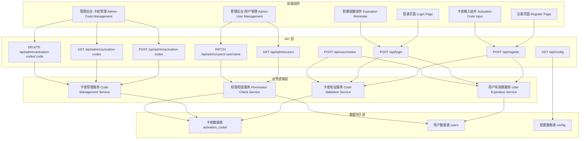

# 卡密激活系统

功能名称：activation-code-system
更新日期：2026-02-11

## 描述

卡密激活系统是一个用于控制用户注册和账号有效期管理的功能模块。该系统通过一次性卡密机制实现新用户注册控制，并为每个账号设置 1 年的有效期。系统支持账号续期、到期提醒、批量生成卡密等功能，同时确保管理员账号不受限制。

## 架构



## 组件和接口

### 前端组件

#### 1. 注册页面增强 (`src/app/register/page.tsx`)

**职责**：在现有注册页面中添加卡密输入字段

**接口**：

- 输入：用户名、密码、确认密码、卡密
- 输出：注册成功/失败响应

**数据流**：

```
用户输入 -> 表单验证 -> 调用 /api/register -> 处理响应
```

#### 2. 登录页面增强 (`src/app/login/page.tsx`)

**职责**：显示到期提醒，处理登录响应

**接口**：

- 输入：用户名、密码
- 输出：登录成功/失败响应，包含到期提醒信息

**数据流**：

```
用户登录 -> 调用 /api/login -> 检查响应中的 expirationReminder -> 显示提醒
```

#### 3. 卡密输入组件 (`src/components/ActivationCodeInput.tsx`)

**职责**：提供卡密输入和格式验证

**接口**：

- Props: `value`, `onChange`, `error`, `disabled`
- Events: `onChange(value)`

**验证规则**：

- 长度：16-32 字符
- 格式：字母数字组合，可选分隔符（如 `XXXX-XXXX-XXXX-XXXX`）

#### 4. 到期提醒组件 (`src/components/ExpirationReminder.tsx`)

**职责**：显示账号到期信息和续期引导

**接口**：

- Props: `daysRemaining`, `expirationDate`, `onRenewClick`
- Events: `onRenewClick()`

**显示状态**：

- 正常（剩余天数 > 30）：不显示或显示基本信息
- 即将过期（0 < 剩余天数 ≤ 30）：显示警告和续期引导
- 已过期（剩余天数 ≤ 0）：显示错误和强制续期提示

#### 5. 管理后台-卡密管理 (`src/app/admin/activation-codes/page.tsx`)

**职责**：提供卡密的增删改查功能

**功能**：

- 批量生成卡密
- 查看卡密列表（状态、创建时间、使用时间）
- 删除卡密
- 导出卡密（CSV/JSON）

#### 6. 管理后台-用户管理增强 (`src/app/admin/users/page.tsx`)

**职责**：在现有用户管理中添加到期日显示和续期功能

**增强功能**：

- 显示每个用户的到期日
- 显示账号状态（正常/即将过期/已过期）
- 为用户手动续期
- 查看用户的续期历史

### API 端点

#### 1. POST /api/register

**职责**：处理用户注册请求，验证卡密

**请求体**：

```typescript
{
  username: string;
  password: string;
  confirmPassword: string;
  activationCode: string; // 新增
}
```

**响应**：

```typescript
// 成功
{
  ok: true;
  message: string;
  needDelay?: boolean;
}

// 失败
{
  error: string;
}
```

**错误码**：

- `INVALID_CODE`: 无效的卡密
- `CODE_USED`: 卡密已被使用
- `CODE_REQUIRED`: 需要提供卡密（当系统启用时）

**处理逻辑**：

1. 检查系统是否启用卡密系统
2. 验证卡密格式
3. 检查卡密是否存在且未被使用
4. 创建用户账号
5. 设置账号到期日（当前日期 + 365 天）
6. 将卡密标记为已使用
7. 记录卡密使用记录

#### 2. POST /api/login

**职责**：处理用户登录请求，检查账号有效期

**请求体**：

```typescript
{
  username: string;
  password: string;
}
```

**响应**：

```typescript
// 成功
{
  ok: true;
  expirationInfo?: { // 新增
    expirationDate: string;
    daysRemaining: number;
    needReminder: boolean;
  };
}

// 失败
{
  error: string;
}
```

**错误码**：

- `ACCOUNT_EXPIRED`: 账号已过期

**处理逻辑**：

1. 验证用户名和密码
2. 检查用户角色（管理员跳过有效期检查）
3. 检查当前日期是否在有效期内
4. 计算剩余天数
5. 如果剩余天数 ≤ 30，设置 needReminder = true
6. 返回登录结果和到期信息

#### 3. POST /api/user/renew

**职责**：处理用户账号续期请求

**请求体**：

```typescript
{
  activationCode: string;
}
```

**响应**：

```typescript
// 成功
{
  ok: true;
  newExpirationDate: string;
  daysRemaining: number;
}

// 失败
{
  error: string;
}
```

**错误码**：

- `INVALID_CODE`: 无效的卡密
- `CODE_USED`: 卡密已被使用
- `ALREADY_ADMIN`: 管理员账号无需续期

**处理逻辑**：

1. 验证用户已登录
2. 检查用户角色（管理员无需续期）
3. 验证卡密
4. 将账号到期日延长 365 天
5. 标记卡密为已使用
6. 记录续期历史

#### 4. POST /api/admin/activation-codes

**职责**：批量生成卡密

**请求体**：

```typescript
{
  action: 'generate';
  count: number; // 1-1000
}
```

**响应**：

```typescript
{
  ok: true;
  codes: Array<{
    code: string;
    createdAt: string;
    status: 'unused' | 'used';
  }>;
}
```

**处理逻辑**：

1. 验证管理员权限
2. 验证生成数量（1-1000）
3. 生成指定数量的唯一卡密
4. 保存到数据库
5. 返回生成的卡密列表

#### 5. GET /api/admin/activation-codes

**职责**：获取卡密列表

**查询参数**：

- `status`: 过滤状态（unused/used）
- `page`: 页码
- `limit`: 每页数量

**响应**：

```typescript
{
  codes: Array<{
    code: string;
    createdAt: string;
    usedAt?: string;
    usedBy?: string; // 使用该卡密的用户名
    status: 'unused' | 'used';
  }>;
  total: number;
  page: number;
  limit: number;
}
```

#### 6. DELETE /api/admin/activation-codes/:code

**职责**：删除卡密

**响应**：

```typescript
{
  ok: true;
}
```

#### 7. GET /api/admin/users（增强）

**职责**：获取用户列表（增强版）

**响应增强**：

```typescript
{
  users: Array<{
    username: string;
    role: 'owner' | 'admin' | 'user';
    tags?: string[];
    expirationDate?: string; // 新增
    daysRemaining?: number; // 新增
    status: 'active' | 'expiring' | 'expired'; // 新增
    renewalHistory?: Array<{
      // 新增
      renewedAt: string;
      previousExpiration: string;
      newExpiration: string;
      codeUsed: string;
    }>;
  }>;
}
```

#### 8. PATCH /api/admin/users/:username（增强）

**职责**：更新用户信息（增加续期操作）

**新增操作**：

```typescript
{
  action: 'renew';
  activationCode?: string; // 如果提供，使用指定卡密；否则由管理员直接延长
}
```

#### 9. GET /api/config（增强）

**职责**：获取系统配置（增加卡密系统开关）

**响应增强**：

```typescript
{
  ActivationCodeConfig: {
    enabled: boolean; // 是否启用卡密系统
    defaultValidityDays: number; // 默认有效期天数（默认 365）
    reminderDays: number; // 提醒天数（默认 30）
  }
}
```

## 数据模型

### 1. 卡密数据表 (`activation_codes`)

```typescript
interface ActivationCode {
  code: string; // 卡密字符串（唯一）
  status: 'unused' | 'used';
  createdAt: Date; // 创建时间
  usedAt?: Date; // 使用时间
  usedBy?: string; // 使用该卡密的用户名
  createdBy: string; // 创建该卡密的管理员用户名
}
```

**存储键格式**：

```
activation_codes:{code}
```

**索引**：

- 主键：`code`
- 状态索引：`activation_codes:status:{status}`
- 创建者索引：`activation_codes:created_by:{username}`

### 2. 用户数据表扩展 (`users`)

现有 `users` 表需要新增字段：

```typescript
interface User {
  // 现有字段
  username: string;
  password: string;
  role: 'owner' | 'admin' | 'user';
  tags?: string[];
  enabledApis?: string[];
  banned?: boolean;
  createdAt?: number;
  oidcSub?: string;

  // 新增字段
  expirationDate?: Date; // 账号到期日
  lastRenewedAt?: Date; // 最后续期时间
}
```

### 3. 续期历史表 (`user_renewal_history`)

```typescript
interface RenewalHistory {
  id: string; // 唯一ID
  username: string; // 用户名
  renewedAt: Date; // 续期时间
  previousExpiration: Date; // 之前的到期日
  newExpiration: Date; // 新的到期日
  codeUsed: string; // 使用的卡密
  renewedBy: string; // 操作者（用户自己或管理员）
}
```

**存储键格式**：

```
user_renewal_history:{username}:{id}
```

### 4. 系统配置扩展 (`config`)

在现有配置中新增卡密系统配置：

```typescript
interface ActivationCodeConfig {
  enabled: boolean; // 是否启用卡密系统
  defaultValidityDays: number; // 默认有效期天数
  reminderDays: number; // 提醒天数
}
```

## 正确性属性

### 1. 卡密唯一性

- **不变式**：系统中不存在重复的卡密
- **验证方法**：在生成卡密时检查数据库中是否已存在，如果存在则重新生成

### 2. 卡密一次性使用

- **不变式**：一个卡密只能被使用一次
- **验证方法**：在使用卡密前检查其状态，只有状态为 `unused` 的卡密才能使用，使用后立即标记为 `used`

### 3. 用户账号有效期

- **不变式**：普通用户在有效期外无法访问系统
- **验证方法**：在每次 API 请求时检查用户的 `expirationDate`，如果当前日期超过到期日则拒绝访问

### 4. 管理员不受限制

- **不变式**：管理员角色的用户不受卡密和有效期限制
- **验证方法**：在权限检查中，如果用户角色为 `owner` 或 `admin`，则跳过卡密验证和有效期检查

### 5. 续期一致性

- **不变式**：续期操作必须将到期日延长固定天数（默认 365 天）
- **验证方法**：续期时记录 `previousExpiration` 和 `newExpiration`，确保 `newExpiration = previousExpiration + 365 days`

## 错误处理

### 1. 卡密相关错误

| 错误场景     | HTTP 状态码 | 错误码                    | 错误信息                  |
| ------------ | ----------- | ------------------------- | ------------------------- |
| 卡密不存在   | 400         | `INVALID_CODE`            | 无效的卡密                |
| 卡密已被使用 | 400         | `CODE_USED`               | 该卡密已被使用            |
| 卡密格式错误 | 400         | `INVALID_CODE_FORMAT`     | 卡密格式错误              |
| 未提供卡密   | 400         | `CODE_REQUIRED`           | 请输入卡密                |
| 生成数量超限 | 400         | `GENERATE_LIMIT_EXCEEDED` | 单次生成数量不能超过 1000 |

### 2. 用户相关错误

| 错误场景       | HTTP 状态码 | 错误码            | 错误信息                                 |
| -------------- | ----------- | ----------------- | ---------------------------------------- |
| 账号已过期     | 401         | `ACCOUNT_EXPIRED` | 账号已过期，请联系管理员或使用新卡密续期 |
| 管理员无需续期 | 400         | `ALREADY_ADMIN`   | 管理员账号无需续期                       |
| 用户不存在     | 404         | `USER_NOT_FOUND`  | 用户不存在                               |

### 3. 权限相关错误

| 错误场景 | HTTP 状态码 | 错误码         | 错误信息           |
| -------- | ----------- | -------------- | ------------------ |
| 未登录   | 401         | `UNAUTHORIZED` | 未登录或登录已过期 |
| 权限不足 | 403         | `FORBIDDEN`    | 权限不足           |

### 4. 系统相关错误

| 错误场景   | HTTP 状态码 | 错误码           | 错误信息               |
| ---------- | ----------- | ---------------- | ---------------------- |
| 数据库错误 | 500         | `DATABASE_ERROR` | 数据库错误，请稍后重试 |
| 服务器错误 | 500         | `INTERNAL_ERROR` | 服务器错误             |

## 测试策略

### 1. 单元测试

#### 卡密验证服务

- 测试卡密格式验证
- 测试卡密存在性检查
- 测试卡密状态检查
- 测试卡密使用标记

#### 用户有效期服务

- 测试到期日计算
- 测试剩余天数计算
- 测试过期判断
- 测试提醒触发条件

#### 权限检查服务

- 测试管理员权限识别
- 测试普通用户权限识别
- 测试权限验证逻辑

### 2. 集成测试

#### 注册流程

- 测试启用卡密系统时的注册（有效卡密）
- 测试启用卡密系统时的注册（无效卡密）
- 测试启用卡密系统时的注册（已使用卡密）
- 测试禁用卡密系统时的注册
- 测试账号到期日设置

#### 登录流程

- 测试有效期内登录
- 测试已过期登录
- 测试管理员登录（跳过有效期检查）
- 测试到期提醒触发

#### 续期流程

- 测试用户自续期（有效卡密）
- 测试用户自续期（无效卡密）
- 测试管理员手动续期
- 测试续期历史记录

#### 卡密管理

- 测试批量生成卡密
- 测试卡密列表查询
- 测试卡密删除
- 测试卡密导出

### 3. 端到端测试

#### 完整用户生命周期

1. 管理员生成卡密
2. 新用户使用卡密注册
3. 用户登录并查看到期信息
4. 用户到期前收到提醒
5. 用户使用新卡密续期
6. 续期后正常使用

#### 管理员操作流程

1. 管理员登录
2. 查看用户列表和到期日
3. 为即将过期的用户手动续期
4. 批量生成新卡密
5. 导出卡密列表

### 4. 性能测试

- 测试批量生成 1000 个卡密的响应时间
- 测试高并发登录场景下的有效期检查性能
- 测试卡密列表查询的性能（大数据量）

### 5. 安全测试

- 测试卡密猜测攻击防护
- 测试并发使用同一卡密的防护
- 测试管理员权限提升的安全性
- 测试到期日篡改防护

## 参考资料

[^1]: (网站) - Next.js API Routes 文档 (https://nextjs.org/docs/api-routes/introduction)

[^2]: (文件) - /workspace/src/app/api/register/route.ts - 现有注册 API 实现

[^3]: (文件) - /workspace/src/app/api/login/route.ts - 现有登录 API 实现

[^4]: (文件) - /workspace/src/app/api/admin/user/route.ts - 现有管理员用户 API 实现

[^5]: (文件) - /workspace/src/lib/db.ts - 数据库操作接口
